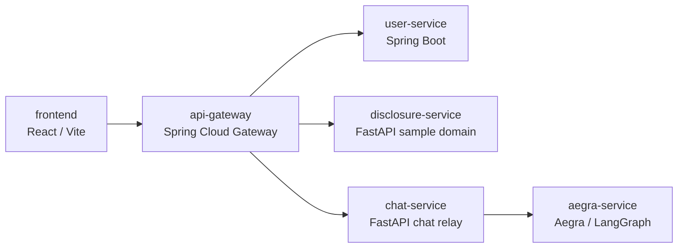

# chat-base-starter

[English](README.md) | [한국어](README.ko.md)

This repository extends `msa-base-starter` into a forkable MSA sample for adding AI chat. The active root demonstrates a browser-facing chat relay in front of an internal Aegra/LangGraph runtime.

## Active Architecture

```text
frontend (React/Vite, :3003)
  -> api-gateway (Spring Cloud Gateway, :8080)
    -> user-service (Spring Boot, auth/account)
    -> disclosure-service (FastAPI sample domain service)
    -> chat-service (FastAPI, browser-facing chat relay)
      -> aegra-service (Aegra/LangGraph agent runtime)
```

The browser talks only to the gateway. `chat-service` owns conversation metadata and user ownership checks. `aegra-service` stays internal and handles agent execution.



## Service-Level Environment Files

Each service keeps its own `.env.example` next to the code.

```text
docker/postgres/.env.example
api-gateway/.env.example
user-service/.env.example
disclosure-service/.env.example
chat-service/.env.example
frontend/.env.example
aegra-service/.env.example
```

Before first run, copy them to `.env` files:

```bash
cp docker/postgres/.env.example docker/postgres/.env
cp api-gateway/.env.example api-gateway/.env
cp user-service/.env.example user-service/.env
cp disclosure-service/.env.example disclosure-service/.env
cp chat-service/.env.example chat-service/.env
cp frontend/.env.example frontend/.env
cp aegra-service/.env.example aegra-service/.env
```

Then set a real OpenAI key in `aegra-service/.env`.

## Database Layout

All Python services still share one Postgres container, but they no longer share one logical database:

- `disclosure-service` -> `disclosuredb`
- `chat-service` -> `chatdb`
- `aegra-service` -> `aegradb`

Those databases are created during Postgres initialization from `docker/postgres/init/01-init-multiple-dbs.sh`, using values from `docker/postgres/.env`.

## Ports

Public entrypoints:

- Frontend: `http://localhost:3003`
- API Gateway: `http://localhost:8080`
- MySQL: `localhost:3307`
- Postgres: `localhost:5433`

Internal-only by default:

- `chat-service`
- `aegra-service`

This keeps the gateway as the default browser-facing backend boundary.

## Chat API Surface

Gateway through `http://localhost:8080`:

- `GET /api/chat/conversations`
- `POST /api/chat/conversations`
- `GET /api/chat/conversations/{conversationId}`
- `POST /api/chat/conversations/{conversationId}/messages`

## Quick Start

### 1. Prepare env files

Copy each `*.env.example` file to `*.env`, then update values for your local machine.

Minimum required change:

- `aegra-service/.env` -> set `OPENAI_API_KEY`

Optional tuning:

- `chat-service/.env` -> increase `AEGRA_STATE_TIMEOUT_SECONDS` if thread state reads time out while the agent is still busy

### 2. Start the stack

```bash
docker compose up -d
```

If you changed DB bootstrap variables or want a fully clean reset:

```bash
docker compose down -v --remove-orphans
docker compose up -d
```

### 3. Access services

- Frontend: `http://localhost:3003`
- Gateway health: `http://localhost:8080/actuator/health`

## Demo-Only Choices

This repository intentionally keeps a few shortcuts for local startup speed. Forking teams should review these before using the repo as a production base.

- `frontend` stores JWTs in `localStorage` for demo simplicity; production apps should usually prefer httpOnly cookie or session-based strategies.
- `user-service` and `chat-service` create or evolve schema automatically during startup; production systems should use explicit migrations.
- Gateway-to-service trust uses forwarded identity headers plus a shared internal secret; keep downstream services private and strengthen service-to-service trust before production use.
- The disclosure domain data is still sample content from the original starter and should be treated as optional reference code, not a required part of the AI chat architecture.

## Verification Notes

Verified locally:

- `docker compose config`
- `npm run build` in `frontend/`
- `python3 -m compileall app` in `chat-service/`
- `python3 -m compileall src` in `aegra-service/`
- Docker image builds for `frontend`, `chat-service`, `aegra-service`, `api-gateway`
- Gateway login and chat conversation/message flow through `http://localhost:8080`
